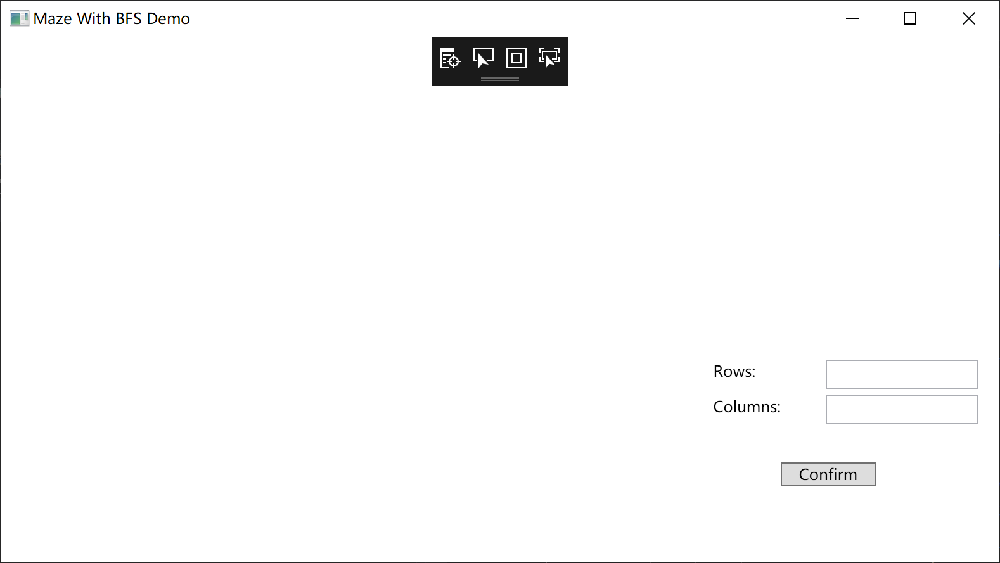
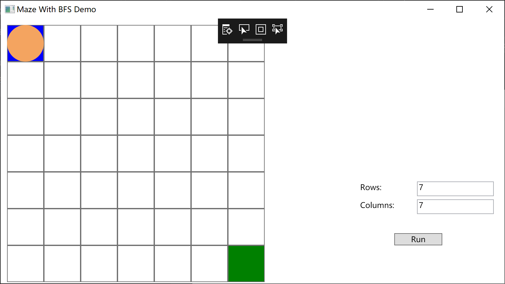
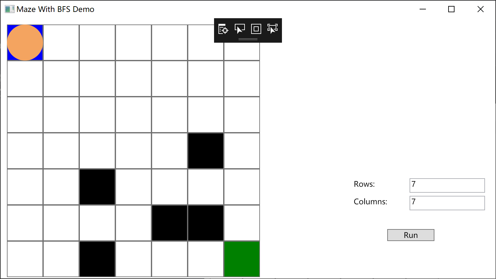
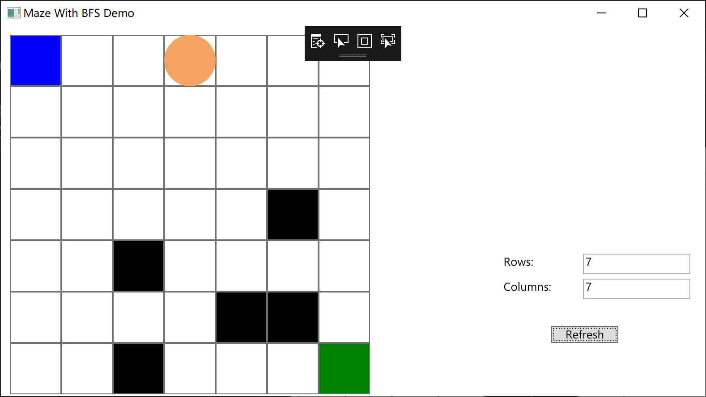

# 迷宫解决方案

初始状态:



输入行数和列数并点击Confirm即可生成空白地图



点击地图可翻转方块



点击Run开始运行:



运行时也可翻转方块，点击Refresh按照新的行数和列数重新刷新空白地图

## 代码

* MainWindow.xaml

```xaml
<Window x:Class="BFS_With_Maze_Demo.MainWindow"
        xmlns="http://schemas.microsoft.com/winfx/2006/xaml/presentation"
        xmlns:x="http://schemas.microsoft.com/winfx/2006/xaml"
        xmlns:d="http://schemas.microsoft.com/expression/blend/2008"
        xmlns:mc="http://schemas.openxmlformats.org/markup-compatibility/2006"
        xmlns:local="clr-namespace:BFS_With_Maze_Demo"
        mc:Ignorable="d"
        Title="Maze With BFS Demo" Height="450" Width="800">
    <Window.Resources>
        <Style TargetType="Button" x:Key="{x:Type local:BlockButton}">
            <Setter Property="Template">
                <Setter.Value>
                    <ControlTemplate TargetType="local:BlockButton">
                        <Grid>
                            <Border BorderBrush="{TemplateBinding BorderBrush}" BorderThickness="{TemplateBinding BorderThickness}">
                                <Rectangle Fill="{TemplateBinding Background}"/>
                            </Border>
                            <Ellipse Fill="SandyBrown" Visibility="{TemplateBinding CircleVisibility}"/>
                        </Grid>
                    </ControlTemplate>
                </Setter.Value>
            </Setter>
        </Style>
    </Window.Resources>

    <Grid>
        <Grid Name="MainGird" HorizontalAlignment="Left" Height="402.5" Margin="10,10,0,0" VerticalAlignment="Top" Width="402.5"/>
        <TextBlock HorizontalAlignment="Left" Margin="561.73,284.221,0,0" TextWrapping="Wrap" Text="Columns:" VerticalAlignment="Top"/>
        <TextBlock HorizontalAlignment="Left" Margin="561.73,256.221,0,0" TextWrapping="Wrap" Text="Rows:" VerticalAlignment="Top"/>
        <TextBox Name="RowText" HorizontalAlignment="Left" Height="23" Margin="650.346,255.221,0,0" TextWrapping="Wrap" VerticalAlignment="Top" Width="120"/>
        <TextBox Name="ColumnText" HorizontalAlignment="Left" Height="23" Margin="650.346,283.221,0,0" TextWrapping="Wrap" VerticalAlignment="Top" Width="120"/>
        <Button Content="Confirm" HorizontalAlignment="Left" Margin="615,336,0,0" VerticalAlignment="Top" Width="75" Click="Confirm_Click"/>
    </Grid>
</Window>
```


* MainWindow.xaml.cs

```c#
using System;
using System.Windows;
using System.Windows.Controls;

namespace BFS_With_Maze_Demo
{
    /// <summary>
    /// MainWindow.xaml 的交互逻辑
    /// </summary>
    public partial class MainWindow : Window
    {
        private readonly WindowModel model;

        public MainWindow()
        {
            InitializeComponent();
            model = new WindowModel()
            {
                Dispatcher = Dispatcher
            };
        }

        private void Confirm_Click(object sender, RoutedEventArgs e)
        {
            var btn = sender as Button;
            if (btn.Content.ToString() == "Confirm")
            {
                Reset();
                btn.Content = "Run";
            }
            else if (btn.Content.ToString() == "Run")
            {
                model.Stepping = true;
                btn.Content = "Refresh";
            }
            else if (btn.Content.ToString() == "Refresh")
            {
                model.Stepping = false;
                Reset();
                btn.Content = "Run";
            }
        }

        private void Reset()
        {
            try
            {
                int r = int.Parse(RowText.Text), c = int.Parse(ColumnText.Text);

                model.Resize(r, c);
                GridResize(MainGird, r, c);
                ButtonRefill(MainGird, model, r, c);
            }
            catch (ArgumentOutOfRangeException)
            {
                MessageBox.Show("R or C out of range , recommend range is [2,50]", "OutOfRangeException", MessageBoxButton.OK, MessageBoxImage.Error); ;
            }
            catch (FormatException)
            {
                MessageBox.Show("Text format Error , decimal integer please", "FormatError", MessageBoxButton.OK, MessageBoxImage.Error);
            }
        }

        private static void ButtonRefill(Grid grid, WindowModel model, int r, int c)
        {
            for (int i = 0; i < r; ++i)
            {
                for (int j = 0; j < c; ++j)
                {
                    Button button = new BlockButton(model.buttonModels[i, j]);
                    grid.Children.Add(button);
                    button.SetValue(Grid.RowProperty, i);
                    button.SetValue(Grid.ColumnProperty, j);
                }
            }
        }

        private static void GridResize(Grid grid,int r,int c)
        {
            if (r < 0 || c < 0) throw new ArgumentOutOfRangeException();
            grid.Children.Clear();
            grid.RowDefinitions.Clear();
            grid.ColumnDefinitions.Clear();
            for (int i = 0; i < r; ++i) grid.RowDefinitions.Add(new RowDefinition());
            for (int i = 0; i < c; ++i) grid.ColumnDefinitions.Add(new ColumnDefinition());
        }
    }

    /// <summary>
    /// 迷宫中每个块的一个自定义控件
    /// </summary>
    public class BlockButton : Button
    {
        private ButtonModel model;
        public BlockButton(ButtonModel model = null)
        {
            this.model = model ?? new ButtonModel();
            this.model.OnStatusChanged += (s, e) => Background = model.Brush;
            this.model.OnDrivenChanged += (s, e) => CircleVisibility = model.IsDriven ? Visibility.Visible : Visibility.Hidden;
            Background = model.Brush; CircleVisibility = model.IsDriven ? Visibility.Visible : Visibility.Hidden;
        }

        protected override void OnClick()
        {
            base.OnClick();
            switch (model.Status)
            {
                case Status.BARREL:
                    model.Status = Status.CLEAR;
                    break;
                case Status.CLEAR:
                    model.Status = Status.BARREL;
                    break;
            }
        }

        public readonly static DependencyProperty CircleVisibilityProperty =
            DependencyProperty.Register("CircleVisibility", typeof(Visibility), typeof(BlockButton));

        public Visibility CircleVisibility
        {
            get => (Visibility) GetValue(CircleVisibilityProperty);
            set { SetValue(CircleVisibilityProperty, value); }
        }
    }
}

```

* Model.cs


```c#
using System;
using System.Collections.Generic;
using System.Linq;
using System.Windows.Media;
using System.Threading.Tasks;
using System.Threading;
using System.Windows.Threading;

namespace BFS_With_Maze_Demo
{
    /// <summary>
    /// 某一个格子本身的状态
    /// </summary>
    public enum Status { EXIT, ENTER, CLEAR, BARREL, };


    public class WindowModel
    {
        private CancellationTokenSource CTS = new CancellationTokenSource();
        public Dispatcher Dispatcher;
        public ButtonModel[,] buttonModels;
        public Queue<(int r, int c)> ShortestPath { get; private set; } = new Queue<(int r, int c)>();
        (int r, int c) cur;
        private bool isStepping = false;
        public bool Stepping
        {
            get => isStepping;
            set
            {
                if (!isStepping && value)
                {
                    Task.Factory.StartNew(() => StepIn(ShortestPath,CTS), CTS.Token);
                    isStepping = value;
                }
                else if (isStepping && !value)
                {
                    CTS.Cancel();
                    CTS = new CancellationTokenSource();
                    isStepping = value;
                }
            }
        }

        private int R, C;

        public WindowModel(int r = 1, int c = 1) => Resize(r, c);

        /// <summary>
        /// 重新生成相应大小的网格元素
        /// </summary>
        /// <param name="r">所需生成的行数</param>
        /// <param name="c">列数</param>
        public void Resize(int r, int c)
        {
            if (r <= 0 || c <= 0)
                throw new ArgumentOutOfRangeException("r || c");
            R = r; C = c;
            buttonModels = new ButtonModel[r, c];
            for (int i = 0; i < r; ++i)
                for (int j = 0; j < c; ++j)
                {
                    buttonModels[i, j] = new ButtonModel();
                    buttonModels[i, j].OnStatusChanged += (s, e) =>
                    {
                        if (Stepping == true)
                        {
                            Stepping = false;
                            RefreshPath();
                            Stepping = true;
                        }
                        else RefreshPath();
                    };
                }
            buttonModels[0, 0] = Status.ENTER;
            buttonModels[0, 0].IsDriven = true;
            buttonModels[r - 1, c - 1] = Status.EXIT;
            ShortestPath.Enqueue(cur = (0, 0));
            RefreshPath();
        }

        /// <summary>
        /// 使用 BFS 算法查询最短路，如果没有最短路则返回一个单个节点的路径
        /// </summary>
        public void RefreshPath()
        {
            Queue<(int r, int c)> q = new Queue<(int r, int c)>();
            bool[,] vis = new bool[R, C];
            var prev = new (int r, int c)[R, C];
            for (var i = 0; i < R; ++i)
                for (var j = 0; j < C; ++j)
                {
                    vis[i, j] = false;
                    prev[i, j] = (-1, -1);
                }
            q.Enqueue(cur);
            vis[cur.r,cur.c] = true;

            while (q.Count != 0)
            {
                int[] dr = { -1, 0, 1, 0 };
                int[] dc = { 0, 1, 0, -1 };
                var (r, c) = q.Dequeue();
                if ((r, c) == (R - 1, C - 1)) break;
                foreach (var dir in Enumerable.Range(0, 4))
                {
                    var (nr, nc) = (r + dr[dir], c + dc[dir]);
                    if (0 <= nr && nr < R && 0 <= nc && nc < C && buttonModels[nr, nc].Status != Status.BARREL && !vis[nr, nc])
                    {
                        vis[nr, nc] = true;
                        prev[nr, nc] = (r, c);
                        q.Enqueue((nr, nc));
                    }
                }
            }

            ShortestPath = new Queue<(int r, int c)>();
            if (!vis[R - 1, C - 1])
            {
                ShortestPath.Enqueue(cur);
                return;
            }

            var tmp = new Stack<(int, int)>();
            for (var (r, c) = (R - 1, C - 1); (r, c) != (-1, -1); (r, c) = prev[r, c])
                tmp.Push((r, c));
            while (tmp.Count > 0) ShortestPath.Enqueue(tmp.Pop());
            return;
        }

        private Mutex mutex = new Mutex();
        Action backward = null;
        public void StepIn(Queue<(int r, int c)> ShortestPath, CancellationTokenSource cts)
        {
            mutex.WaitOne();
            while (ShortestPath.Count > 0)
            {
                if (cts.IsCancellationRequested) break;
                backward?.Invoke();
                var (r, c) = cur = ShortestPath.Dequeue();
                Dispatcher.Invoke(() => buttonModels[r, c].IsDriven = true);
                backward = () => Dispatcher.Invoke(() => buttonModels[r, c].IsDriven = false);
                Task.Delay(1000).Wait();
            }
            mutex.ReleaseMutex();
        }
    }

    public class ButtonModel
    {
        public delegate void ModeChanged(object sender,EventArgs e);
        public event ModeChanged OnStatusChanged, OnDrivenChanged;
        
        private Status status = Status.CLEAR;
        public Status Status {
            get => status;
            set
            {
                if (status != value)
                {
                    status = value;
                    OnStatusChanged?.Invoke(this,null);
                }
            }
        }
        private bool driven = false;
        public bool IsDriven {
            get => driven;
            set
            {
                if (driven != value)
                {
                    driven = value;
                    OnDrivenChanged?.Invoke(this,null);
                }
            }
        }

        public Brush Brush
        {
            get
            {
                switch (Status)
                {
                    case Status.BARREL:
                        return Brushes.Black;
                    case Status.CLEAR:
                        return Brushes.White;
                    case Status.ENTER:
                        return Brushes.Blue;
                    case Status.EXIT:
                        return Brushes.Green;
                    default:
                        return null;
                }
            }
        }
        public static implicit operator ButtonModel(Status e) => new ButtonModel { status=e };
    }
}
```

